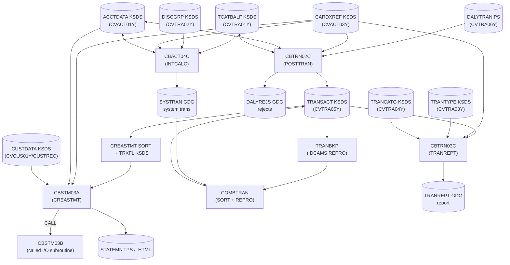

# CardDemo Batch Posting Cycle — Modernization Knowledge Transfer

> **Scope.** This document describes the CardDemo **batch posting cycle**: the sequence of
> COBOL batch programs that take the day's captured card activity (the *daily transaction
> file*), validate and post it against the account/card masters, accrue interest and fees,
> back up and combine the transaction master, and produce customer statements and reports.
> It is intended as a knowledge-transfer artifact for a modernization / service-extraction
> effort. It is documentation only — no COBOL sources were modified.
>
> Source of truth: the JCL under `app/jcl/`, the batch COBOL under `app/cbl/`, the copybooks
> under `app/cpy/`, and the "Running Batch Jobs" section of the top-level `README.md`.

---

## 1. Overview

The posting cycle is a classic mainframe **daily batch pipeline**. Online CICS activity during
the day is captured; overnight the batch jobs run in a fixed order, each communicating with the
next almost entirely through **files** (VSAM KSDS clusters and flat sequential/GDG datasets)
rather than through APIs or shared memory. This file-to-file coupling is the dominant
integration pattern and the primary consideration for any service-extraction effort
(see [§6](#6-modernization-considerations)).

The financially significant programs are:

| Program  | Job (JCL)  | Role in the posting cycle                                                        |
| :------- | :--------- | :------------------------------------------------------------------------------- |
| CBTRN02C | `POSTTRAN` | **Core posting.** Validate daily transactions, update balances, post or reject.  |
| CBACT04C | `INTCALC`  | **Interest & fees.** Accrue monthly interest per category, emit system trans.    |
| CBSTM03A/B | `CREASTMT` | **Statements.** Produce per-card statements in plain text and HTML.            |
| CBTRN03C | `TRANREPT` | **Reporting.** Produce a formatted transaction detail report for a date range.   |
| CBTRN01C | *(standalone)* | **Alternate reader/validator.** Reads daily trans + all masters (read-only). |

The surrounding **utility jobs** (IDCAMS / SORT / IEFBR14) move, back up, sort, combine, and
re-define the VSAM datasets between the COBOL steps. They carry no business logic but are
essential to the data flow and are documented alongside the programs.

---

## 2. Execution Order

The canonical order is the `README.md` **"Running Batch Jobs"** sequence. Jobs are grouped
below into *prepare*, *post*, and *finalize/report* phases. Steps marked *(optional module)*
are only present when the corresponding add-on (DB2 Transaction Type, IMS-DB2-MQ Auth) is
installed.

| # | Job        | Program / Utility | Phase     | Purpose                                                        |
|:--|:-----------|:------------------|:----------|:--------------------------------------------------------------|
| 1 | `CLOSEFIL` | IEFBR14           | prepare   | Close VSAM files held open by CICS so batch can own them.     |
| 2 | `ACCTFILE` | IDCAMS            | prepare   | Refresh/reload Account Master VSAM from sample PS.            |
| 3 | `CARDFILE` | IDCAMS            | prepare   | Refresh/reload Card Master VSAM.                              |
| 4 | `XREFFILE` | IDCAMS            | prepare   | Refresh/reload Card↔Account↔Customer cross-reference VSAM.    |
| 5 | `CUSTFILE` | IDCAMS            | prepare   | Refresh/reload Customer Master VSAM.                          |
| 6 | `TRANBKP`  | IDCAMS + `REPROC` | prepare   | Back up Transaction Master to GDG, then delete & re-DEFINE it.|
| 7 | `TRANEXTR` | DSNTIAUL          | prepare*  | Extract latest tran type/category from DB2 *(optional)*.      |
| 8 | `TRANCATG` | IDCAMS            | prepare   | Load Transaction Category reference VSAM.                     |
| 9 | `TRANTYPE` | IDCAMS            | prepare   | Load Transaction Type reference VSAM.                         |
| 10| `DISCGRP`  | IDCAMS            | prepare   | Load Disclosure Group (interest-rate) reference VSAM.         |
| 11| `TCATBALF` | IDCAMS            | prepare   | Refresh Transaction Category Balance VSAM.                    |
| 12| `DUSRSECJ` | IEBGENER          | prepare   | Load user-security VSAM (not part of financial flow).        |
| 13| **`POSTTRAN`** | **CBTRN02C**  | **post**  | **Post daily transactions; update balances; write rejects.** |
| 14| **`INTCALC`**  | **CBACT04C**  | **post**  | **Compute interest & fees; write system-generated trans.**   |
| 15| `TRANBKP`  | IDCAMS + `REPROC` | finalize  | Back up the now-posted Transaction Master to GDG.            |
| 16| `COMBTRAN` | SORT + IDCAMS     | finalize  | Merge system-generated trans with the master; reload VSAM.   |
| 17| **`CREASTMT`** | **CBSTM03A/B**| finalize  | **Produce per-card statements (text + HTML).**               |
| 18| `TRANIDX`  | IDCAMS            | finalize  | (Re)define the alternate index over the Transaction Master.  |
| 19| `OPENFIL`  | IEFBR14           | finalize  | Re-open VSAM files to CICS for online use.                    |
| 20| `WAITSTEP` | COBSWAIT          | finalize  | Timed wait (`MVSWAIT`) used for scheduling/pacing.           |
| 21| `TRANREPT` | CBTRN03C          | report    | Filter by date range and print transaction detail report.   |
| 22| `CBPAUP0J` | CBPAUP0C          | report*   | Purge expired pending authorizations *(IMS-DB2-MQ optional)*.|

> **Note on `TRANBKP`.** It appears twice — once before posting (snapshot + fresh cluster)
> and once after posting (snapshot of results). Both use the same JCL, writing to the GDG
> `AWS.M2.CARDDEMO.TRANSACT.BKUP(+1)`.
>
> **Note on `TRANREPT`.** In the shipped scheduler it is typically submitted **from CICS**
> (README: "Transaction Report - Submitted from CICS") rather than being part of the strict
> nightly stream, but it consumes posting-cycle output and is included here for completeness.

---

## 3. Program-by-Program Detail

Each subsection lists the program's function, the JCL that runs it, and its inputs/outputs by
**DD name → dataset → copybook**. Dataset names use the `AWS.M2.CARDDEMO.*` HLQ from the JCL.

### 3.1 CBTRN02C — Post daily transactions (`POSTTRAN`)

- **Function:** Read the daily transaction file; for each record **validate** (card exists in
  XREF, account exists, within credit limit, not past account expiration), then either **post**
  it (update category balance, update account balance, write to the Transaction Master) or
  **reject** it (write to the daily rejects file with a reason code).
- **JCL:** `app/jcl/POSTTRAN.jcl` — `EXEC PGM=CBTRN02C`.

| Direction | DD       | Dataset                                   | Type          | Copybook   | Record                |
|:----------|:---------|:------------------------------------------|:--------------|:-----------|:----------------------|
| in        | DALYTRAN | `DALYTRAN.PS`                             | seq (FB 350)  | CVTRA06Y   | `DALYTRAN-RECORD`     |
| in/out    | TRANFILE | `TRANSACT.VSAM.KSDS`                       | VSAM KSDS     | CVTRA05Y   | `TRAN-RECORD`         |
| in        | XREFFILE | `CARDXREF.VSAM.KSDS`                       | VSAM KSDS     | CVACT03Y   | `CARD-XREF-RECORD`    |
| in/out    | ACCTFILE | `ACCTDATA.VSAM.KSDS`                       | VSAM KSDS     | CVACT01Y   | `ACCOUNT-RECORD`      |
| in/out    | TCATBALF | `TCATBALF.VSAM.KSDS`                       | VSAM KSDS     | CVTRA01Y   | `TRAN-CAT-BAL-RECORD` |
| out       | DALYREJS | `DALYREJS(+1)`                            | GDG (F 430)   | *(inline)* | reject rec + trailer  |

- **Validation reason codes** (written on the reject trailer): `100` invalid card number,
  `101` account not found, `102` over-limit, `103` transaction after account expiration.
- **Balance math:** available balance check is
  `ACCT-CURR-CYC-CREDIT − ACCT-CURR-CYC-DEBIT + DALYTRAN-AMT ≤ ACCT-CREDIT-LIMIT`.
  On post, the category balance (`TCATBALF`) row is created if missing then updated, and the
  account record is rewritten.

### 3.2 CBACT04C — Interest & fee calculator (`INTCALC`)

- **Function:** Walk the Transaction Category Balance file; for each account resolve the
  interest rate from the **Disclosure Group** file, compute monthly interest
  `(TRAN-CAT-BAL × DIS-INT-RATE) / 1200`, add it to the account balance, and **emit a
  system-generated transaction** for the interest/fee to a new sequential file. Takes the run
  date as a `PARM` (e.g. `PARM='2022071800'`).
- **JCL:** `app/jcl/INTCALC.jcl` — `EXEC PGM=CBACT04C,PARM=...`.

| Direction | DD       | Dataset                              | Type         | Copybook | Record                |
|:----------|:---------|:-------------------------------------|:-------------|:---------|:----------------------|
| in        | TCATBALF | `TCATBALF.VSAM.KSDS`                  | VSAM KSDS    | CVTRA01Y | `TRAN-CAT-BAL-RECORD` |
| in        | XREFFILE | `CARDXREF.VSAM.KSDS`                  | VSAM KSDS    | CVACT03Y | `CARD-XREF-RECORD`    |
| in        | XREFFIL1 | `CARDXREF.VSAM.AIX.PATH`             | VSAM AIX path| CVACT03Y | `CARD-XREF-RECORD`    |
| in/out    | ACCTFILE | `ACCTDATA.VSAM.KSDS`                  | VSAM KSDS    | CVACT01Y | `ACCOUNT-RECORD`      |
| in        | DISCGRP  | `DISCGRP.VSAM.KSDS`                   | VSAM KSDS    | CVTRA02Y | `DIS-GROUP-RECORD`    |
| out       | TRANSACT | `SYSTRAN(+1)`                        | GDG (F 350)  | CVTRA05Y | `TRAN-RECORD`         |

- The `SYSTRAN(+1)` output (system-generated interest transactions) is the key hand-off to
  `COMBTRAN`, which merges it back into the Transaction Master.

### 3.3 CBSTM03A / CBSTM03B — Statement generation (`CREASTMT`)

- **Function:** `CBSTM03A` is the driver: for each card in the XREF it gathers account,
  customer, and transaction data and writes a **plain-text** statement and an **HTML**
  statement. `CBSTM03B` is a called subroutine that performs the actual file reads (it
  demonstrates dynamic file handling via the TIOT / control-block addressing exercised for
  modernization tooling). `CBSTM03A` **statically calls `CBSTM03B`** many times.
- **JCL:** `app/jcl/CREASTMT.JCL`. Preceding utility steps: `IDCAMS` deletes/DEFINEs a
  by-card KSDS `TRXFL.VSAM.KSDS`; `SORT` copies `TRANSACT.VSAM.KSDS` re-keyed by
  (card number, tran id) into `TRXFL.SEQ`; `IDCAMS REPRO` loads it into `TRXFL.VSAM.KSDS`;
  `IEFBR14` deletes prior report outputs; then `CBSTM03A` runs.

**CBSTM03A:**

| Direction | DD       | Dataset                          | Type        | Copybook  | Record             |
|:----------|:---------|:---------------------------------|:------------|:----------|:-------------------|
| in        | TRNXFILE | `TRXFL.VSAM.KSDS`                 | VSAM KSDS   | (via 03B) | transaction by card|
| in        | XREFFILE | `CARDXREF.VSAM.KSDS`             | VSAM KSDS   | CVACT03Y  | `CARD-XREF-RECORD` |
| in        | ACCTFILE | `ACCTDATA.VSAM.KSDS`            | VSAM KSDS   | CVACT01Y  | `ACCOUNT-RECORD`   |
| in        | CUSTFILE | `CUSTDATA.VSAM.KSDS`            | VSAM KSDS   | CUSTREC   | `CUSTOMER-RECORD`  |
| out       | STMTFILE | `STATEMNT.PS`                    | seq (FB 80) | COSTM01   | text statement     |
| out       | HTMLFILE | `STATEMNT.HTML`                 | seq (FB 100)| COSTM01   | HTML statement     |

- **Copybooks in `CBSTM03A`:** `COSTM01`, `CVACT03Y`, `CUSTREC`, `CVACT01Y`.
- **`CBSTM03B`** SELECTs: `TRNXFILE`, `XREFFILE`, `CUSTFILE`, `ACCTFILE` (it is the I/O layer
  invoked through the `WS-M03B-AREA` parameter area passed on each `CALL`).

### 3.4 CBTRN03C — Transaction detail report (`TRANREPT`)

- **Function:** Read a date-filtered, card-sorted transaction file and produce a formatted
  report, enriching each line with transaction-type and category descriptions and applying
  report headers.
- **JCL:** `app/jcl/TRANREPT.jcl`. Preceding steps back up the master (`REPROC`) and `SORT`
  it (filter `TRAN-PROC-DT` between `PARM-START-DATE`/`PARM-END-DATE`, sort by card number)
  into `TRANSACT.DALY(+1)`, which becomes the report input.

| Direction | DD       | Dataset                     | Type        | Copybook | Record             |
|:----------|:---------|:----------------------------|:------------|:---------|:-------------------|
| in        | TRANFILE | `TRANSACT.DALY(+1)`         | GDG seq     | CVTRA05Y | `TRAN-RECORD`      |
| in        | CARDXREF | `CARDXREF.VSAM.KSDS`        | VSAM KSDS   | CVACT03Y | `CARD-XREF-RECORD` |
| in        | TRANTYPE | `TRANTYPE.VSAM.KSDS`        | VSAM KSDS   | CVTRA03Y | `TRAN-TYPE-RECORD` |
| in        | TRANCATG | `TRANCATG.VSAM.KSDS`        | VSAM KSDS   | CVTRA04Y | `TRAN-CAT-RECORD`  |
| in        | DATEPARM | `DATEPARM`                  | seq         | *(local)*| start/end dates    |
| out       | TRANREPT | `TRANREPT(+1)`              | GDG (FB 133)| CVTRA07Y | report headers     |

### 3.5 CBTRN01C — Daily transaction reader / validator (standalone)

- **Function:** Reads the daily transaction file and, per record, reads the full master set
  (customer, XREF, card, account, transaction) — a **read-only** validation/inspection pass.
  It is not wired into the `POSTTRAN` job but shares the same file/copybook footprint as
  `CBTRN02C`; useful as a reference for the read side of posting.
- **Inputs (SELECTs):** `DALYTRAN` (CVTRA06Y), `CUSTFILE` (CVCUS01Y), `XREFFILE` (CVACT03Y),
  `CARDFILE` (CVACT02Y), `ACCTFILE` (CVACT01Y), `TRANFILE` (CVTRA05Y).

### 3.6 Utility & support programs

| Job/Step   | Utility   | Role                                                                 |
|:-----------|:----------|:--------------------------------------------------------------------|
| `TRANBKP`  | IDCAMS + `REPROC` proc | REPRO Transaction Master → GDG backup; DELETE + DEFINE cluster. |
| `COMBTRAN` | SORT + IDCAMS | Merge `TRANSACT.BKUP(0)` + `SYSTRAN(0)` by `TRAN-ID` → `TRANSACT.COMBINED(+1)`; REPRO into `TRANSACT.VSAM.KSDS`. |
| `CLOSEFIL`/`OPENFIL` | IEFBR14 | Ownership handoff of VSAM files between CICS and batch.       |
| `TRANIDX`  | IDCAMS    | DEFINE alternate index / path over the Transaction Master.          |
| `WAITSTEP` | COBSWAIT  | Wrapper over assembler `MVSWAIT` for a timed pause.                  |

---

## 4. Copybook & Dataset Reference

Copybooks are the **shared record contracts** across the cycle. The same copybook is `COPY`d
into every program that touches its file, so a change to any of these ripples across multiple
programs — a central modernization concern (see [§6](#6-modernization-considerations)).

| Copybook | Record (01)          | Logical entity                     | Primary dataset(s)                     |
|:---------|:---------------------|:-----------------------------------|:---------------------------------------|
| CVTRA06Y | `DALYTRAN-RECORD`    | Daily transaction (input)          | `DALYTRAN.PS`                          |
| CVTRA05Y | `TRAN-RECORD`        | Posted transaction (master)        | `TRANSACT.VSAM.KSDS`, `SYSTRAN`, `TRXFL`|
| CVACT01Y | `ACCOUNT-RECORD`     | Account master                     | `ACCTDATA.VSAM.KSDS`                   |
| CVACT02Y | `CARD-RECORD`        | Card master                        | `CARDDATA` / `CARDFILE`                |
| CVACT03Y | `CARD-XREF-RECORD`   | Card↔Account↔Customer cross-ref    | `CARDXREF.VSAM.KSDS` (+ AIX path)      |
| CVCUS01Y | `CUSTOMER-RECORD`    | Customer master                    | `CUSTDATA.VSAM.KSDS`                   |
| CUSTREC  | `CUSTOMER-RECORD`    | Customer (statement view)          | `CUSTDATA.VSAM.KSDS`                   |
| CVTRA01Y | `TRAN-CAT-BAL-RECORD`| Transaction category balance       | `TCATBALF.VSAM.KSDS`                   |
| CVTRA02Y | `DIS-GROUP-RECORD`   | Disclosure group / interest rate   | `DISCGRP.VSAM.KSDS`                    |
| CVTRA03Y | `TRAN-TYPE-RECORD`   | Transaction type reference         | `TRANTYPE.VSAM.KSDS`                   |
| CVTRA04Y | `TRAN-CAT-RECORD`    | Transaction category reference     | `TRANCATG.VSAM.KSDS`                   |
| CVTRA07Y | `REPORT-NAME-HEADER` | Report header layout               | `TRANREPT` (report)                    |
| COSTM01  | statement layout     | Statement line formats             | `STATEMNT.PS`, `STATEMNT.HTML`         |
| CODATECN | date-conversion area | Passed to assembler `COBDATFT`     | *(no file)*                            |

---

## 5. Call / Data-Flow Diagram

*Solid arrows are data reads/writes; `<-->` marks a file that is both read and rewritten in the
same step; the `CALL` edge is the only in-process program-to-program link in the cycle
(`CBSTM03A → CBSTM03B`). Every other program boundary is a **dataset boundary**.*

---

## 6. CICS Transaction → Screen (BMS Map) → Program

The posting cycle is batch-only, but its data is created and consulted online through CICS.
The table below maps each **CICS transaction ID → BMS map (screen) → COBOL program**, drawn
from `README.md` and the `app/bms/` mapsets. Transactions **CT00/CT01/CT02** (transaction
list/view/add) and **CB00** (bill payment) are the online counterparts that feed and read the
same Transaction Master the batch cycle posts to.

| Txn ID | BMS Map (mapset) | Program  | Screen / Function                | Optional module            |
|:-------|:-----------------|:---------|:---------------------------------|:---------------------------|
| CC00   | COSGN00          | COSGN00C | Signon                           |                            |
| CM00   | COMEN01          | COMEN01C | Main Menu                        |                            |
| CAVW   | COACTVW          | COACTVWC | Account View                     |                            |
| CAUP   | COACTUP          | COACTUPC | Account Update                   |                            |
| CCLI   | COCRDLI          | COCRDLIC | Credit Card List                 |                            |
| CCDL   | COCRDSL          | COCRDSLC | Credit Card View                 |                            |
| CCUP   | COCRDUP          | COCRDUPC | Credit Card Update               |                            |
| CT00   | COTRN00          | COTRN00C | Transaction List                 |                            |
| CT01   | COTRN01          | COTRN01C | Transaction View                 |                            |
| CT02   | COTRN02          | COTRN02C | Transaction Add                  |                            |
| CR00   | CORPT00          | CORPT00C | Transaction Reports (submit batch)|                           |
| CB00   | COBIL00          | COBIL00C | Bill Payment                     |                            |
| CA00   | COADM01          | COADM01C | Admin Menu                       | DB2: Transaction Type Mgmt |
| CU00   | COUSR00          | COUSR00C | List Users                       |                            |
| CU01   | COUSR01          | COUSR01C | Add User                         |                            |
| CU02   | COUSR02          | COUSR02C | Update User                      |                            |
| CU03   | COUSR03          | COUSR03C | Delete User                      |                            |
| CTTU   | COTRTUP          | COTRTUPC | Transaction Type add/edit        | DB2: Transaction Type Mgmt |
| CTLI   | COTRTLI          | COTRTLIC | Transaction Type list/upd/del    | DB2: Transaction Type Mgmt |
| CPVS   | COPAU00          | COPAUS0C | Pending Authorization Summary    | IMS-DB2-MQ: Pending Auth   |
| CPVD   | COPAU01          | COPAUS1C | Pending Authorization Details    | IMS-DB2-MQ: Pending Auth   |
| CP00   | *(none — MQ)*    | COPAUA0C | Process Authorization Requests   | IMS-DB2-MQ: Pending Auth   |
| CDRD   | *(none — MQ)*    | CODATE01 | Inquire System Date via MQ       | MQ Integration             |
| CDRA   | *(none — MQ)*    | COACCT01 | Inquire Account Details via MQ   | MQ Integration             |

> Transactions **CP00 / CDRD / CDRA** have no BMS map — they are message-driven (MQ) entry
> points rather than 3270 screens.

---

## 7. Modernization Considerations

This section flags the couplings that would most complicate breaking the posting cycle into
independently deployable services.

### 7.1 File-based integration is the real API
Every program-to-program hand-off in the cycle (except `CBSTM03A→CBSTM03B`) happens through a
**dataset**, not a call. `CBACT04C` communicates with the rest of the world by writing
`SYSTRAN(+1)`; `COMBTRAN` merges it back; `CREASTMT` re-keys the master into `TRXFL` before it
can read it. Any service extraction must first replace these implicit file contracts with
explicit, versioned interfaces (events or APIs). The GDG generations (`(+1)`/`(0)`) also encode
**temporal ordering** that a distributed system must reproduce (idempotency + ordering
guarantees).

### 7.2 Shared copybooks create a distributed monolith
The record layouts in [§4](#4-copybook--dataset-reference) are `COPY`d verbatim into many
programs:

- **CVACT01Y (`ACCOUNT-RECORD`)** — used by CBTRN01C, CBTRN02C, CBACT04C, CBSTM03A (and online
  account programs). It is the single most cross-cutting contract; the account balance fields
  it defines are **both read and rewritten** by two different batch programs (CBTRN02C posts to
  it, CBACT04C accrues interest into it).
- **CVACT03Y (`CARD-XREF-RECORD`)** — the card↔account↔customer join used by nearly every
  program (CBTRN01C/02C/03C, CBACT04C, CBSTM03A/B). It is effectively the routing key of the
  whole domain; extracting a "card" service vs. an "account" service is hard because this one
  record couples them.
- **CVTRA05Y (`TRAN-RECORD`)** / **CVTRA06Y (`DALYTRAN-RECORD`)** — near-identical transaction
  layouts; posting is largely a field-by-field `MOVE` from one to the other (`CBTRN02C
  2000-POST-TRANSACTION`). A modernized model likely wants a single canonical Transaction
  schema rather than two.
- **CVTRA01Y (`TRAN-CAT-BAL-RECORD`)** — shared write-target between posting (CBTRN02C) and
  interest (CBACT04C), so category-balance ownership is split across two programs.

Because these copybooks are compiled in, changing a field length is a **multi-program,
recompile-everything** change with no encapsulation — the classic obstacle to independent
deployment.

### 7.3 Tight couplings to flag for service extraction
- **Account balance is co-owned.** `CBTRN02C` (posting) and `CBACT04C` (interest) both `REWRITE`
  the account record. Splitting posting and interest into separate services requires resolving
  who owns `ACCT-CURR-BAL` / cycle credit/debit and how concurrent updates are serialized
  (batch relies on exclusive file ownership via `CLOSEFIL`/`OPENFIL`).
- **XREF as a hidden join service.** The card→account→customer lookup is duplicated in-line in
  each program rather than centralized. A `Cross-Reference`/identity service is a natural first
  extraction and would remove the most widespread copybook dependency (CVACT03Y).
- **Reference data (rates, types, categories).** `DISCGRP`, `TRANTYPE`, `TRANCATG` are read-only
  reference files loaded fresh each run. These are low-risk, high-value first candidates for a
  standalone **reference-data service** (small, stable, widely read, no write-back).
- **Interest calc ↔ reference + balance.** `CBACT04C` joins category balance + disclosure
  group + account. Its interest formula `(bal × rate) / 1200` and fee logic are pure and easily
  portable, but it depends on the category-balance store being fully posted first — a **hard
  ordering dependency** on `POSTTRAN`.
- **Statement generation reaches across the whole domain.** `CBSTM03A`/`CBSTM03B` read
  transaction, xref, account, and customer data and use control-block/TIOT addressing tricks;
  the `CBSTM03A→CBSTM03B` static `CALL` is the one in-process seam. This is a good candidate for
  a read-only **statement/reporting service** built on a read model rather than the operational
  masters.
- **Utility steps encode business rules in JCL.** `COMBTRAN`'s SORT key, `CREASTMT`'s re-key
  SORT, and `TRANREPT`'s date-range `INCLUDE` filter live in JCL, not COBOL. Modernization must
  capture this logic that is invisible from the source programs alone.
- **Scheduling/orchestration.** The strict job order (and `WAITSTEP`/`MVSWAIT` pauses,
  `CLOSEFIL`/`OPENFIL` ownership toggles) is orchestration currently expressed in the scheduler
  (Control-M/CA7 under `app/scheduler/`). A modern pipeline needs an explicit orchestrator to
  replace these file-ownership and timing dependencies.

### 7.4 Suggested extraction order (lowest coupling first)
1. **Reference-data service** (DISCGRP / TRANTYPE / TRANCATG) — read-only, stable.
2. **Cross-reference / identity service** (CVACT03Y) — removes the most pervasive dependency.
3. **Statement & reporting service** (CBSTM03A/B, CBTRN03C) — read-only consumers of a read model.
4. **Interest service** (CBACT04C) — pure computation, but ordered after posting.
5. **Posting service** (CBTRN02C) — core write path; extract last, once account-balance
   ownership and the XREF/reference dependencies are already service-fronted.
