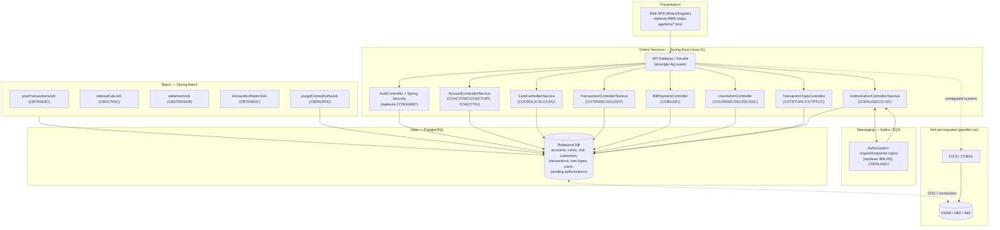

# Phase 0 — Modernization Assessment

**Application:** CardDemo — mainframe credit card management system
**Effort:** COBOL/CICS → modern Java (Spring Boot + Spring Batch)
**Phase:** 0 — Assessment & Inventory (documentation only; no application code changes)
**Repository:** `ankehao-demo/aws-mainframe-modernization-carddemo`

> This document is grounded in the actual repository contents. Inventories were built by listing
> `app/cbl/`, `app/app-authorization-ims-db2-mq/cbl/`, `app/app-vsam-mq/cbl/`,
> `app/app-transaction-type-db2/cbl/`, `app/cpy/`, `app/jcl/`, `app/bms/`, and `app/asm/`,
> cross-checked against the README *Application Inventory* tables (README.md lines ~269–326).
> File paths are cited inline so every table row maps to a real source artifact.

---

## 0. Current-State Overview

CardDemo is a CICS pseudo-conversational online application plus a suite of batch jobs:

- **Online programs** (`CO*.cbl`, `app/cbl/`) — 3270/BMS screens driven by CICS transactions
  (`CC00`–`CDRA`), navigating between each other with `EXEC CICS XCTL` and a shared COMMAREA.
- **Batch programs** (`CB*.cbl`, `app/cbl/`) — sequential/indexed file processing orchestrated by JCL
  (`app/jcl/`) and PROCs (`app/proc/`).
- **Assembler utilities** (`app/asm/`) — `COBDATFT` (date conversion) and `MVSWAIT` (interval timer).
- **Optional modules:**
  - `app/app-authorization-ims-db2-mq/` — pending-authorization decisioning over IMS DB + DB2 + IBM MQ.
  - `app/app-transaction-type-db2/` — transaction-type maintenance backed by DB2.
  - `app/app-vsam-mq/` — MQ request/response demos (date inquiry, account inquiry).
- **Data stores:** VSAM (KSDS + alternate indexes), DB2 (transaction types, authorization fraud),
  IMS DB (pending authorizations), IBM MQ (POS/authorization messaging).
- **Screens:** BMS maps in `app/bms/` (`*.bms`) with generated symbolic copybooks in `app/cpy-bms/`.

The target is a modern Java implementation: Spring Boot REST services for online transactions, Spring Batch
for batch jobs, a relational database (PostgreSQL) to replace VSAM/DB2/IMS, REST APIs + a web SPA to replace
BMS maps, and a Java messaging layer (Kafka/SQS) to replace MQ.

---

## 1. Program Inventory and Java Target Mapping

### 1.1 Online programs (`app/cbl/`, transactions `CC00`–`CDRA`)

| Program | Txn ID | BMS Map | Current function | Proposed Java target |
|:--------|:-------|:--------|:-----------------|:---------------------|
| `COSGN00C` | `CC00` | `COSGN00` | Signon screen; validates user/password against `USRSEC` (VSAM) | `AuthController` + `AuthService` + Spring Security (JWT/session); login endpoint |
| `COMEN01C` | `CM00` | `COMEN01` | Main menu (regular users) | `MenuController` (menu metadata API) + front-end routing |
| `COADM01C` | `CA00` | `COADM01` | Admin menu | `AdminMenuController` + role-gated routes (`ROLE_ADMIN`) |
| `COACTVWC` | `CAVW` | `COACTVW` | Account view (read account + customer) | `AccountController` GET + `AccountService` |
| `COACTUPC` | `CAUP` | `COACTUP` | Account update | `AccountController` PUT + `AccountService` (validation + optimistic locking) |
| `COCRDLIC` | `CCLI` | `COCRDLI` | Credit card list | `CardController` GET (list/paged) + `CardService` |
| `COCRDSLC` | `CCDL` | `COCRDSL` | Credit card view (detail) | `CardController` GET by id + `CardService` |
| `COCRDUPC` | `CCUP` | `COCRDUP` | Credit card update | `CardController` PUT + `CardService` |
| `COTRN00C` | `CT00` | `COTRN00` | Transaction list | `TransactionController` GET (list/paged) + `TransactionService` |
| `COTRN01C` | `CT01` | `COTRN01` | Transaction view (detail) | `TransactionController` GET by id + `TransactionService` |
| `COTRN02C` | `CT02` | `COTRN02` | Transaction add | `TransactionController` POST + `TransactionService` |
| `CORPT00C` | `CR00` | `CORPT00` | Transaction reports (submits `TRANREPT` job) | `ReportController` POST → triggers Spring Batch report job |
| `COBIL00C` | `CB00` | `COBIL00` | Bill payment | `BillPaymentController` POST + `BillPaymentService` |
| `COUSR00C` | `CU00` | `COUSR00` | List users (admin) | `UserAdminController` GET + `UserService` |
| `COUSR01C` | `CU01` | `COUSR01` | Add user (admin) | `UserAdminController` POST + `UserService` |
| `COUSR02C` | `CU02` | `COUSR02` | Update user (admin) | `UserAdminController` PUT + `UserService` |
| `COUSR03C` | `CU03` | `COUSR03` | Delete user (admin) | `UserAdminController` DELETE + `UserService` |

### 1.2 Optional-module online programs

| Program | Txn ID | BMS Map | Module | Current function | Proposed Java target |
|:--------|:-------|:--------|:-------|:-----------------|:---------------------|
| `COPAUS0C` | `CPVS` | `COPAU00` | IMS-DB2-MQ auth (`app/app-authorization-ims-db2-mq/cbl/`) | Pending authorization summary (read IMS + VSAM) | `AuthorizationController` GET (summary) + `AuthorizationService` |
| `COPAUS1C` | `CPVD` | `COPAU01` | IMS-DB2-MQ auth | Pending authorization details (update IMS, insert DB2) | `AuthorizationController` GET/PUT (detail) + `AuthorizationService` |
| `COPAUS2C` | — | — | IMS-DB2-MQ auth | Mark authorization message as fraud | `AuthorizationController` POST `/fraud` + `FraudService` (DB2 → RDBMS) |
| `COPAUA0C` | `CP00` | — | IMS-DB2-MQ auth | Authorization decision engine: MQ-triggered request/response, IMS insert/update (`app/app-authorization-ims-db2-mq/cbl/COPAUA0C.cbl`) | Kafka/SQS consumer + `AuthorizationDecisionService` (stateless) |
| `COADM01C` | `CA00` | `COADM01` | (admin shell) | Admin menu, enables tran-type options | see §1.1 |
| `COTRTUPC` | `CTTU` | `COTRTUP` | DB2 tran-type (`app/app-transaction-type-db2/cbl/`) | Transaction type add/edit (DB2 update + insert) | `TransactionTypeController` POST/PUT + `TransactionTypeService` |
| `COTRTLIC` | `CTLI` | `COTRTLI` | DB2 tran-type | Transaction type list/update/delete (DB2 cursor + delete) | `TransactionTypeController` GET/DELETE + `TransactionTypeService` |
| `CODATE01` | `CDRD` | — | MQ integration (`app/app-vsam-mq/cbl/`) | Inquire system date via MQ request/response | `DateService` (native Java `LocalDate`; MQ pattern retired) |
| `COACCT01` | `CDRA` | — | MQ integration (`app/app-vsam-mq/cbl/`) | Inquire account details via MQ request/response | `AccountController` GET (replaces MQ round-trip with REST) |

### 1.3 Batch programs (`app/cbl/`, orchestrated by `app/jcl/`)

| Program | JCL job | Current function | Proposed Java target |
|:--------|:--------|:-----------------|:---------------------|
| `CBTRN02C` | `POSTTRAN` (`app/jcl/POSTTRAN.jcl`) | Post daily transactions to the transaction master | Spring Batch job `postTransactionsJob` (chunk-oriented) |
| `CBTRN01C` | — | Daily transaction posting (read/validate variant) | Spring Batch step (reader/processor) |
| `CBTRN03C` | `TRANREPT` (`app/jcl/TRANREPT.jcl`, `app/proc/TRANREPT.prc`) | Print transaction detail report | Spring Batch job `transactionReportJob` |
| `CBACT01C` | `READACCT` (`app/jcl/READACCT.jcl`) | Read account master file and print/extract | Spring Batch step (`ItemReader`/`ItemWriter`) |
| `CBACT02C` | `READCARD` (`app/jcl/READCARD.jcl`) | Read and print card data file | Spring Batch step |
| `CBACT03C` | `READXREF` (`app/jcl/READXREF.jcl`) | Read and print card xref file | Spring Batch step |
| `CBACT04C` | `INTCALC` (`app/jcl/INTCALC.jcl`) | Interest calculation (account × disclosure-group × tran-cat balances) | Spring Batch job `interestCalcJob` (`BigDecimal` arithmetic) |
| `CBCUS01C` | `READCUST` (`app/jcl/READCUST.jcl`) | Read and print customer data file | Spring Batch step |
| `CBSTM03A` | `CREASTMT` (`app/jcl/CREASTMT.JCL`) | Produce account statements (plain text + HTML) | Spring Batch job `statementJob` (template-rendered output) |
| `CBSTM03B` | (subprogram of `CBSTM03A`) | File-processing helper for statement reporting | Java helper component / `ItemReader` |
| `CBEXPORT` | `CBEXPORT` (`app/jcl/CBEXPORT.jcl`) | Export customer data for branch migration | Spring Batch export job |
| `CBIMPORT` | `CBIMPORT` (`app/jcl/CBIMPORT.jcl`) | Import customer data from branch export | Spring Batch import job |
| `COBSWAIT` | `WAITSTEP` (`app/jcl/WAITSTEP.jcl`) | Utility: wait a given interval (centiseconds) | Replace with orchestrator delay / `Thread.sleep` (or remove) |
| `CSUTLDTC` | (called utility) | Date validation via LE `CEEDAYS` API | Java `DateValidator` using `java.time` |

### 1.4 Optional-module batch programs

| Program | JCL job | Module | Current function | Proposed Java target |
|:--------|:--------|:-------|:-----------------|:---------------------|
| `CBPAUP0C` | `CBPAUP0J` (`app/app-authorization-ims-db2-mq/jcl/CBPAUP0J.jcl`) | IMS-DB2-MQ auth | Purge expired pending authorization messages | Spring Batch job `purgeExpiredAuthsJob` (or scheduled task) |
| `PAUDBLOD` | `LOADPADB` (`.../jcl/LOADPADB.JCL`) | IMS-DB2-MQ auth | Load pending-authorization DB2 table | One-time ETL / Spring Batch loader (Phase 1) |
| `PAUDBUNL` | `UNLDPADB` (`.../jcl/UNLDPADB.JCL`) | IMS-DB2-MQ auth | Unload pending-authorization DB2 table | ETL extractor (Phase 1) |
| `DBUNLDGS` | `UNLDGSAM` (`.../jcl/UNLDGSAM.JCL`) | IMS-DB2-MQ auth | Unload GSAM data set | ETL extractor (Phase 1) |
| `COBTUPDT` | `MNTTRDB2` | DB2 tran-type (`app/app-transaction-type-db2/cbl/COBTUPDT.cbl`) | Maintain transaction-type table (DB2) | Spring Batch / service updater against RDBMS |

### 1.5 Assembler utilities (`app/asm/`)

| Program | Current function | Proposed Java target |
|:--------|:-----------------|:---------------------|
| `COBDATFT` (`app/asm/COBDATFT.asm`) | Date format/conversion utility called from COBOL | Native Java `java.time` formatting/parsing — **rewrite, do not transpile** |
| `MVSWAIT` (`app/asm/MVSWAIT.asm`) | MVS interval timer (`ASMWAIT`) used to pause | Remove (orchestrator delay) or `Thread.sleep`/scheduler |

> JCL jobs run via IBM utilities (`IDCAMS`, `IEBGENER`, `IEFBR14`, `SORT`, `DSNTEP4`, `DSNTIAUL`) — e.g.
> VSAM define/load (`ACCTFILE`, `CARDFILE`, `XREFFILE`, `TRANIDX`), GDG setup (`DEFGDGB`/`DEFGDGD`) — map to
> Flyway migrations, schema DDL, and Spring Batch/SQL load steps rather than 1:1 program rewrites.

---

## 2. Copybook / Data Model Inventory

### 2.1 Core data copybooks (`app/cpy/`)

| Copybook | 01-level record | Entity | Notable fields / types |
|:---------|:----------------|:-------|:-----------------------|
| `CVACT01Y.cpy` | `ACCOUNT-RECORD` (RECLN 300) | Account | `ACCT-ID PIC 9(11)`; balances `ACCT-CURR-BAL`/`ACCT-CREDIT-LIMIT`/`ACCT-CASH-CREDIT-LIMIT`/`ACCT-CURR-CYC-CREDIT`/`ACCT-CURR-CYC-DEBIT PIC S9(10)V99`; dates `ACCT-OPEN-DATE`/`ACCT-EXPIRAION-DATE`/`ACCT-REISSUE-DATE PIC X(10)` |
| `CVACT02Y.cpy` | `CARD-RECORD` (RECLN 150) | Card | `CARD-NUM PIC X(16)`; `CARD-ACCT-ID PIC 9(11)`; `CARD-CVV-CD PIC 9(03)`; `CARD-EXPIRAION-DATE PIC X(10)` |
| `CVACT03Y.cpy` | `CARD-XREF-RECORD` (RECLN 50) | Card↔Account↔Customer xref | `XREF-CARD-NUM PIC X(16)`; `XREF-CUST-ID PIC 9(09)`; `XREF-ACCT-ID PIC 9(11)` |
| `CVCUS01Y.cpy` | `CUSTOMER-RECORD` (RECLN 500) | Customer | `CUST-ID PIC 9(09)`; name/address `PIC X`; `CUST-SSN PIC 9(09)`; `CUST-DOB-YYYY-MM-DD PIC X(10)`; `CUST-FICO-CREDIT-SCORE PIC 9(03)` |
| `CVTRA05Y.cpy` | `TRAN-RECORD` (RECLN 350) | Transaction | `TRAN-ID PIC X(16)`; `TRAN-AMT PIC S9(09)V99`; `TRAN-MERCHANT-ID PIC 9(09)`; timestamp fields |
| `CVTRA06Y.cpy` | `DALYTRAN-RECORD` (RECLN 350) | Daily (unposted) transaction | mirrors `TRAN-RECORD`; input to `CBTRN02C` posting |
| `CVTRA01Y.cpy` | transaction category balance (RECLN 50) | Tran-category balance | account/type/category key + balance `S9..V99` |
| `CVTRA02Y.cpy` | disclosure group (RECLN 50) | Disclosure group | interest rates (used by `CBACT04C`) |
| `CVTRA03Y.cpy` | transaction type (RECLN 60) | Tran type | type code + description |
| `CVTRA04Y.cpy` | transaction category type (RECLN 60) | Tran category type | type/category code + description |
| `CVTRA07Y.cpy` | transaction report layout | Reporting | report row structure (`CBTRN03C`) |
| `CVCRD01Y.cpy` | `CC-WORK-AREAS` | Card screen work area | online card-screen working storage |
| `CVEXPORT.cpy` | export record | Branch-migration export | structure for `CBEXPORT`/`CBIMPORT` |
| `CUSTREC.cpy` | customer record (RECLN 500) | Customer (alt layout) | alternate customer layout |
| `CSUSR01Y.cpy` | `SEC-USER-DATA` | User security | `SEC-USR-ID X(08)`, `SEC-USR-PWD X(08)` **(cleartext)**, `SEC-USR-TYPE X(01)` |

### 2.2 Shared / utility copybooks (`app/cpy/`)

| Copybook | Purpose |
|:---------|:--------|
| `COCOM01Y.cpy` | **Shared COMMAREA** (`CARDDEMO-COMMAREA`) — navigation state passed between programs via `XCTL`/`RETURN`: `CDEMO-FROM/TO-TRANID/PROGRAM`, `CDEMO-USER-ID`, `CDEMO-USER-TYPE` (`88 CDEMO-USRTYP-ADMIN`), `CDEMO-PGM-CONTEXT`, customer/account/card context, last map/mapset |
| `COMEN02Y.cpy` / `COADM02Y.cpy` | Menu option tables (user / admin menus) |
| `COTTL01Y.cpy` | Common screen title / header layout |
| `CSDAT01Y.cpy` | Current-date work fields |
| `CSMSG01Y.cpy` / `CSMSG02Y.cpy` | Common message / abend work areas |
| `CSUTLDPY.cpy` / `CSUTLDWY.cpy` | Date routine PROCEDURE / WORKING-STORAGE copybooks (paired with `CSUTLDTC`) |
| `CSLKPCDY.cpy` | Lookup codes (phone area codes, state codes, etc.) |
| `CODATECN.cpy`, `CSSETATY.cpy`, `CSSTRPFY.cpy` | Date constants, attribute set, string/PF-key helpers |
| `COSTM01.CPY` | Statement (altered transaction) layout for reporting |

### 2.3 Optional-module copybooks (`app/app-authorization-ims-db2-mq/cpy/`)

| Copybook | Purpose |
|:---------|:--------|
| `CCPAURQY.cpy` | Pending authorization **request** (MQ inbound) |
| `CCPAURLY.cpy` | Pending authorization **response** (MQ outbound) |
| `CCPAUERY.cpy` | Pending authorization **error logs** |
| `CIPAUSMY.cpy` | IMS segment — pending authorization **summary** |
| `CIPAUDTY.cpy` | IMS segment — pending authorization **details** |
| `IMSFUNCS.cpy` | IMS DL/I function-code constants |
| `PAUTBPCB.CPY`, `PADFLPCB.CPY`, `PASFLPCB.CPY` | IMS PCB masks (DB / GSAM access) |

### 2.4 VSAM datasets, keys, and alternate indexes

Confirmed from the `SELECT ... ASSIGN` clauses in `app/cbl/CBACT04C.cbl` (lines 28–56) and the JCL define jobs:

| Dataset (DDname) | Type | Primary key | Alternate index | Defined by |
|:-----------------|:-----|:------------|:----------------|:-----------|
| `XREFFILE` | KSDS | `FD-XREF-CARD-NUM PIC X(16)` (card number) | `FD-XREF-ACCT-ID PIC 9(11)` (account-id AIX) — `CBACT04C.cbl` lines 34–39 | `app/jcl/XREFFILE.jcl` |
| `ACCTFILE` | KSDS | `FD-ACCT-ID PIC 9(11)` | — | `app/jcl/ACCTFILE.jcl` |
| `CARDFILE` | KSDS | card number | card-account path (`CARDAIX`) | `app/jcl/CARDFILE.jcl` |
| `CUSTFILE` | KSDS | `CUST-ID PIC 9(09)` | — | `app/jcl/CUSTFILE.jcl` |
| `TCATBALF` | KSDS | `FD-TRAN-CAT-KEY` (acct-id + type-cd + cat-cd) | — | `app/jcl/TCATBALF.jcl` |
| `DISCGRP` | KSDS | `FD-DISCGRP-KEY` | — | `app/jcl/DISCGRP.jcl` |
| `TRANSACT` / `TRANFILE` | ESDS/seq | sequential | `TRANIDX` AIX (`app/jcl/TRANIDX.jcl`) | `app/jcl/TRANFILE.jcl` |
| `USRSEC` | KSDS | `SEC-USR-ID PIC X(08)` | — | `app/jcl/DUSRSECJ.jcl` |

### 2.5 COBOL numeric/date type-mapping rules (MANDATORY)

| COBOL type | Example fields | Java mapping | Rule |
|:-----------|:---------------|:-------------|:-----|
| `PIC S9(10)V99` (zoned decimal) | account balances, credit limits (`CVACT01Y`) | `java.math.BigDecimal` | **Never** `double`/`float` |
| `PIC S9(09)V99` | `TRAN-AMT` (`CVTRA05Y`) | `BigDecimal` | **Never** `double`/`float` |
| `COMP-3` (packed decimal) | timing/amount fields (e.g. `COPAUA0C` `S9(15) COMP-3`) | `BigDecimal` | **Never** `double`/`float` |
| `PIC 9(n)` (display integer) | `ACCT-ID 9(11)`, `CUST-ID 9(09)` | `Long` (or `String` if identifier, not arithmetic) | Preserve width/leading zeros where it's an identifier |
| `PIC X(10)` date `YYYYMMDD`/`YYYY-MM-DD` | `ACCT-OPEN-DATE`, `CUST-DOB-YYYY-MM-DD` | `java.time.LocalDate` | Parse/validate on the boundary |
| `PIC X(n)` text | names, addresses | `String` | Trim trailing spaces deliberately |

---

## 3. Target Architecture Decision

### 3.1 Chosen stack

| Concern | Mainframe (current) | Target (Java) |
|:--------|:--------------------|:--------------|
| Online transactions | CICS COBOL (`CO*.cbl`) + BMS | **Spring Boot** REST services (`@RestController` + service layer), Java 21 |
| Batch | JCL + COBOL (`CB*.cbl`) | **Spring Batch** jobs (chunk-oriented readers/processors/writers) |
| Data store | VSAM (KSDS/AIX), DB2, IMS DB | **PostgreSQL** (relational), Spring Data JPA; Flyway migrations |
| UI | 3270 / BMS maps (`app/bms/`) | **REST APIs + web SPA** (React or Angular) |
| Messaging | IBM MQ (POS / authorization) | **Kafka or AWS SQS/SNS** (Java messaging layer) |
| Date/utility ASM | `COBDATFT`, `MVSWAIT` | Native Java (`java.time`, scheduler) |
| Security | `USRSEC`/RACF, cleartext compare | **Spring Security** + hashed credentials / IdP (OIDC) |
| Orchestration | JCL job steps (`COND`) | Spring Batch flow / workflow orchestrator (Step Functions/Airflow) |

Numeric fidelity is a hard architectural constraint: every monetary/decimal value uses `BigDecimal`
end to end (DTOs, entities, service math, JSON serialization) — see §2.5 and §5.

### 3.2 Target architecture diagram

---

## 4. Data-Access / Coexistence Strategy

The migration follows the **strangler-fig** pattern: the Java stack grows around the mainframe while both
run in parallel, and traffic is progressively rerouted screen-by-screen.

1. **Facade / router.** A gateway (API gateway + thin facade) fronts all online traffic. Migrated
   transactions (e.g. Account View once `COACTVWC` → `AccountController` is live) are routed to Java; every
   not-yet-migrated transaction continues to invoke CICS. Routing is config-driven so cutover of a single
   screen is a config change, not a redeploy.

2. **Data consistency while both run.** Two complementary options, chosen per dataset:
   - **AWS Mainframe Modernization file/DB connectors** — Java reads/writes the same VSAM/DB2 data through
     M2 connectors during early phases, so there is a single source of truth and no divergence.
   - **CDC replication** — change-data-capture from VSAM/DB2/IMS into PostgreSQL (and back, if Java becomes
     authoritative for a domain), keeping the relational copy continuously in sync. Bulk seed via the
     existing unload paths (`CBEXPORT`, `PAUDBUNL`, `DBUNLDGS`) then maintain with CDC deltas.

3. **Authoritative-system handoff.** Per domain (accounts, cards, transactions, authorizations), define a
   cutover point where the relational DB becomes the system of record; until then the mainframe is
   authoritative and Java is read-mostly / write-through via connectors to avoid dual-write conflicts.

4. **Idempotency & reconciliation.** Nightly reconciliation jobs compare mainframe vs. relational balances
   (`BigDecimal` exact compare) to catch drift early; messaging consumers are idempotent (correlation IDs,
   mirroring the MQ correlation-id handling in `COPAUA0C`).

---

## 5. Risk Register and Cross-Cutting Concerns

| # | Risk / concern | Evidence in repo | Impact | Mitigation |
|:--|:---------------|:-----------------|:-------|:-----------|
| R1 | **Numeric fidelity** — using floating point for money corrupts balances/interest | `S9(10)V99` in `CVACT01Y.cpy`; `S9(09)V99` in `CVTRA05Y.cpy`; `COMP-3` in `COPAUA0C.cbl` | High (financial correctness) | `BigDecimal` everywhere a `V99`/`COMP-3` appears (§2.5); equivalence-test vs. COBOL outputs |
| R2 | **Cleartext password auth** — security exposure; must not be carried forward | `READ-USER-SEC-FILE` in `app/cbl/COSGN00C.cbl` lines 209–245 compares `SEC-USR-PWD = WS-USER-PWD` in cleartext against `CSUSR01Y`/`USRSEC` + RACF | Critical (security/compliance) | Replace with **Spring Security** + hashed credentials (bcrypt/argon2) or an external IdP (OIDC). The cleartext compare **must not** be reimplemented in Java |
| R3 | **Stateful pseudo-conversational model** — COMMAREA + `XCTL`/`RETURN` flow does not map to stateless REST | `EXEC CICS XCTL` / `EXEC CICS RETURN` in `COSGN00C.cbl` (lines 231–239, etc.); `CARDDEMO-COMMAREA` in `COCOM01Y.cpy` | High (architecture) | Become **stateless REST**: COMMAREA navigation state → request/response DTOs + client-side routing; session/auth state → JWT or server session |
| R4 | **Assembler utilities** — non-portable, cannot be transpiled | `app/asm/COBDATFT.asm` (date), `app/asm/MVSWAIT.asm` (timer) | Medium | Rewrite natively in Java (`java.time`, scheduler); do not attempt line-by-line translation |
| R5 | **Two-phase IMS+DB2+MQ authorization flow** — distributed transaction across three subsystems | `COPAUA0C.cbl`: `CALL 'MQGET'/'MQPUT1'`, `EXEC DLI GU/ISRT/REPL` (IMS), DB2 access, `EXEC CICS` | High (correctness + complexity) | Model as event-driven flow (Kafka/SQS) with explicit saga/outbox for atomicity; IMS segments → relational tables; idempotent consumers (correlation IDs) |
| R6 | **VSAM alternate-index semantics** — apps rely on AIX access paths | account-id AIX on `XREFFILE` (`CBACT04C.cbl` lines 34–39); `CARDAIX` path | Medium | Model AIX as secondary indexes / query methods in PostgreSQL; verify uniqueness assumptions |
| R7 | **Date handling / century windowing** — `PIC X(10)` strings, LE `CEEDAYS` validation | `CSUTLDTC.cbl`, `COBDATFT.asm`, date fields across copybooks | Medium | `java.time.LocalDate` with strict parsing; centralize in a `DateService`; test boundary/leap cases |
| R8 | **EBCDIC ↔ ASCII / packed-decimal conversion** during data migration | `app/data/EBCDIC/`, `app/data/ASCII/` | Medium | Use M2/connector codepage conversion and validated ETL; byte-for-byte equivalence tests on migrated records |
| R9 | **Hidden business rules in batch math** (interest, posting) | `CBACT04C` (interest), `CBTRN02C` (posting) | High | Extract each rule as a testable assertion before migrating; run legacy vs. Java equivalence tests |

---

## 6. Phase 0 Exit Criteria and Next Steps

### 6.1 Exit criteria (must be true to start Phase 1)

- [ ] Program inventory (§1), copybook/data-model inventory (§2), and VSAM/DB2/IMS dataset+key catalog
      reviewed and signed off against the actual repo (not just the README).
- [ ] Target stack (§3) approved: Spring Boot + Spring Batch + PostgreSQL + REST/SPA + Kafka/SQS, Java 21.
- [ ] Coexistence approach (§4) chosen per domain: connectors vs. CDC, and the authoritative-system handoff
      points agreed.
- [ ] Risk register (§5) accepted, with R1 (`BigDecimal`) and R2 (no cleartext auth) ratified as
      non-negotiable engineering rules.
- [ ] Test strategy agreed: equivalence testing (legacy vs. migrated, value-for-value) and business-rule
      extraction for batch math (interest, posting).
- [ ] Tooling baseline ready: repo build (`mvn -q -DskipTests package`) and test (`mvn test`) wiring,
      Flyway, CI.

### 6.2 Remaining phases (summary)

| Phase | Scope | Key deliverables |
|:------|:------|:-----------------|
| **Phase 1** | Data model migration + ETL | Relational schema (Flyway) for account/card/xref/customer/transaction/tran-type/user/pending-auth; ETL from VSAM/DB2/IMS (seed via `CBEXPORT`/`PAUDBUNL`/`DBUNLDGS`); CDC/connector wiring; reconciliation |
| **Phase 2** | Batch via Spring Batch | `postTransactionsJob` (`CBTRN02C`), `interestCalcJob` (`CBACT04C`), `statementJob` (`CBSTM03A/B`), `transactionReportJob` (`CBTRN03C`); equivalence-tested |
| **Phase 3** | Online services | Spring Boot REST + SPA for signon/menu/account/card/transaction/bill/user (`CO*.cbl`); Spring Security replaces cleartext auth; facade routes migrated screens to Java |
| **Phase 4** | Optional modules | IMS-DB2-MQ authorization (`COPAUS*`/`COPAUA0C`/`CBPAUP0C`) as event-driven Java; DB2 tran-type (`COTRTUPC`/`COTRTLIC`/`COBTUPDT`); MQ demos (`CODATE01`/`COACCT01`) |
| **Phase 5** | Cutover + decommission | Flip authoritative system to PostgreSQL per domain; retire MQ/IMS/DB2/VSAM and CICS; decommission COBOL/JCL/ASM; final reconciliation |
